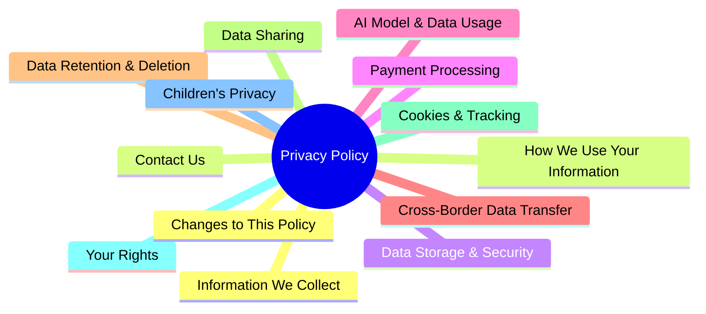
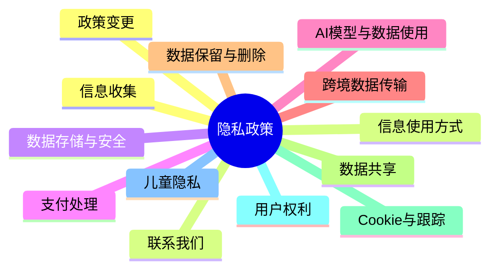

# Privacy Policy Mindmap
# 隐私政策思维导图

## Mermaid Format (English)



## Mermaid 格式 (中文)



## Markdown List Format (English)

```markdown
# Privacy Policy Mindmap

- Privacy Policy
  - Information We Collect
  - How We Use Your Information
  - Data Storage & Security
  - Payment Processing
  - AI Model & Data Usage
  - Cross-Border Data Transfer
  - Data Retention & Deletion
  - Data Sharing
  - Cookies & Tracking
  - Your Rights
  - Children's Privacy
  - Changes to This Policy
  - Contact Us
```

## Markdown 列表格式 (中文)

```markdown
# 隐私政策思维导图

- 隐私政策
  - 信息收集
  - 信息使用方式
  - 数据存储与安全
  - 支付处理
  - AI模型与数据使用
  - 跨境数据传输
  - 数据保留与删除
  - 数据共享
  - Cookie与跟踪
  - 用户权利
  - 儿童隐私
  - 政策变更
  - 联系我们
```
##隐私政策

### 信息收集
用户在使用服务过程中提供的个人信息、设备信息、使用行为数据等可能会被收集，以优化服务体验并履行相关法律义务

### 信息使用方式
用户信息将用于账户管理、服务改进、个性化推荐、安全验证及法律合规等明确声明的用途
### 数据存储与安全
数据存储于符合行业标准的加密环境中，并采取访问控制、安全审计等措施保护您的信息免受未授权访问或泄露

### 支付处理
支付信息由合规的第三方支付服务商处理，不存储用户的完整支付卡号或敏感支付细节

### AI模型与数据使用
明确AI模型的使用问题、对于用户输入数据的处理方式

### 跨境数据传输
用户数据可能跨境传输给AI模型以提供反馈，但不能用于训练模型

### 数据保留与删除
数据保留期限为实现目的所必需，用户可请求删除个人信息，法律法规要求的除外

### 数据共享
直接声明不共享数据，或者在符合双方法律框架下的安全共享

### Cookie与跟踪
使用Cookie及类似技术以提供基础功能、用户可通过浏览器设置管理偏好

### 用户权利
用户享有访问、更正、删除个人信息及撤回同意等权利，可通过指定渠道提出请求。

### 儿童隐私
比如不主动收集13岁以下儿童信息，如发现此类情况将立即删除相关数据。

### 政策变更
隐私政策可能适时更新，重大变更将通过显著方式通知，继续使用服务即视为接受变更。

### 联系我们
留域名相关的官方邮箱
