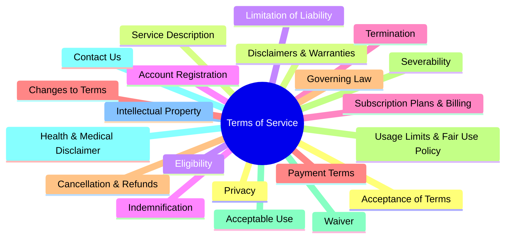
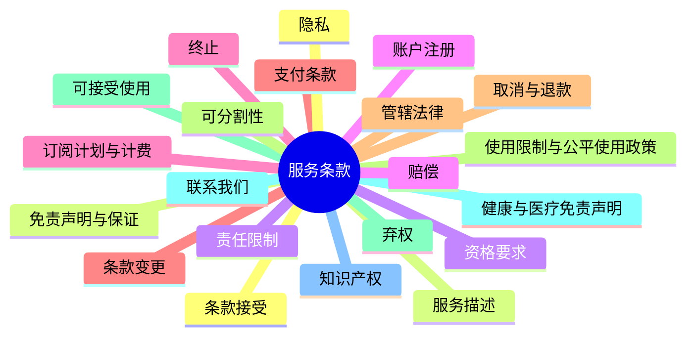

# Terms of Service Mindmap
# 服务条款思维导图

## Mermaid Format (English)



## Mermaid 格式 (中文)



## Markdown List Format (English)

```markdown
# Terms of Service Mindmap

- Terms of Service
  - Acceptance of Terms
  - Service Description
  - Eligibility
  - Account Registration
  - Subscription Plans & Billing
  - Payment Terms
  - Cancellation & Refunds
  - Usage Limits & Fair Use Policy
  - Acceptable Use
  - Health & Medical Disclaimer
  - Intellectual Property
  - Privacy
  - Disclaimers & Warranties
  - Limitation of Liability
  - Indemnification
  - Termination
  - Changes to Terms
  - Governing Law
  - Severability
  - Waiver
  - Contact Us
```

## Markdown 列表格式 (中文)

```markdown
# 服务条款思维导图

- 服务条款
  - 条款接受
  - 服务描述
  - 资格要求
  - 账户注册
  - 订阅计划与计费
  - 支付条款
  - 取消与退款
  - 使用限制与公平使用政策
  - 可接受使用
  - 健康与医疗免责声明
  - 知识产权
  - 隐私
  - 免责声明与保证
  - 责任限制
  - 赔偿
  - 终止
  - 条款变更
  - 管辖法律
  - 可分割性
  - 弃权
  - 联系我们
```


# 服务条款

## 条款接受
声明使用产品即视为接受条款

## 服务描述
根据产品功能总结描述能提供的服务

## 资格要求
大于13岁才可以使用

## 账户注册
使用产品必须注册账户以及享有的权利义务

## 订阅计划与计费
如果提供了订阅模式则明确订阅模式和收费规则

## 支付条款
通过何种支付平台支付、自动续费以及税费处理

## 取消与退款
用户享有取消退款的权利、退款的具体说明

## 使用限制与公平使用政策
如果使用了AI大模型，则具体的使用额度限制以及公平原则说明

## 可接受使用
使用本产品可以做的被法律允许的事项

## 健康与医疗免责声明
使用本产品不能提供的服务，免责声明

## 知识产权
明确双方对于知识产权内容的界定

## 用户隐私
明确声明保护用户隐私、参考隐私政策

## 免责声明与保证
针对产品功能以及内容生产制定的免责条款
## 责任限制
用户使用本产品的责任说明

## 终止服务说明
声明产品在何种情况下可以单方面终止服务

## 条款变更通知
声明条款变更以及更新通知

## 争议法律处理
指明出现争议时协商或者法律处理方式

## 服务条款的可分割性
如本条款任何部分被认定为无效，不影响其余条款的效力。

## 弃权
未执行本条款某项权利不构成对该权利或其它权利的放弃。

## 联系我们
提供域名相关的官方邮箱联系方式


